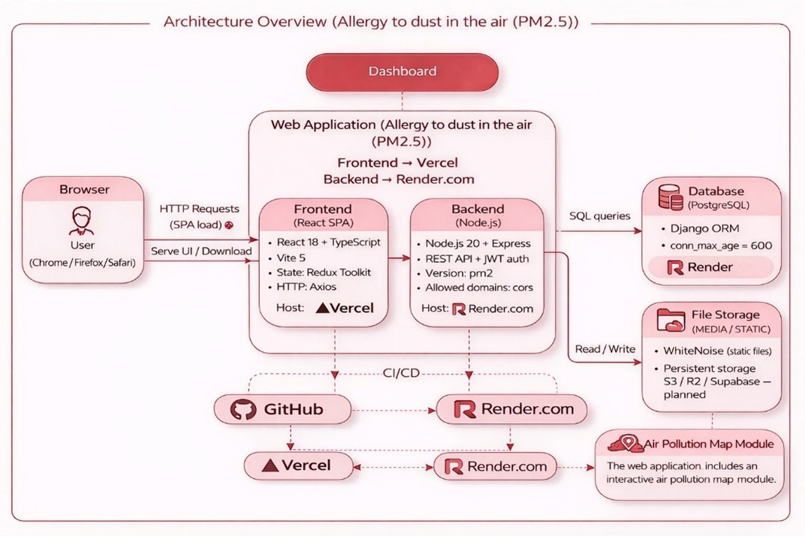

# PM2.5-Allergy-Monitoring-ML

**Abstract:** The article analyzes the impact of atmospheric air pollution on the development and exacerbation of dust allergies in the urban environment of Almaty. It examines biological and environmental factors that intensify allergic reactions under exposure to fine particulate matter PM2.5, including seasonal and climatic influences. Special attention is given to the mechanism of PM2.5 penetration into the respiratory system and its role in triggering inflammation and increasing sensitivity to allergens.
The theoretical review summarizes international and local studies linking PM2.5 concentrations with allergic rhinitis, bronchial asthma, and reduced quality of life. The practical part applies a mixed-method approach, combining air quality monitoring data, surveys, and semi-structured interviews with residents. The findings reveal a consistent correlation between elevated PM2.5 levels and increased allergy symptoms, affecting daily behavior.
Based on the results, the development of a personalized web platform for air quality monitoring is proposed, integrating environmental data, symptom tracking, and recommendation algorithms. The study highlights its relevance for public health planning and potential integration into municipal information systems.

*(Note: This repository highlights the core research findings and methodology. The full academic manuscript and data analysis are actively being published across several academic and media sources. I would be glad to provide the full drafts upon request for interested professors and researchers.)*

  

## 🌱 Personal Motivation
Growing up in Central Asia, I experienced firsthand how environmental challenges like air pollution directly impact community health. I initiated this research because I wanted to move beyond abstract data sets and apply machine learning to a tangible, local problem. This project solidified my belief in AI as a tool for public good, demonstrating how predictive algorithms and data engineering can be used to improve quality of life and inform municipal health planning.

## 🎯 Research Objectives
- Statistically analyze the biological and environmental factors that intensify allergic reactions under exposure to fine particulate matter (PM2.5).
- Apply a mixed-method approach combining quantitative air quality monitoring data with qualitative survey and interview data from local residents.
- Propose an architectural model for a personalized web platform that integrates environmental data streams, symptom tracking, and recommendation algorithms.

## 🧠 Methodology & Tech Stack
- **Data Sources:** Public PM2.5 air quality API streams (Almaty region) combined with semi-structured public health surveys.
- **Data Analysis:** Python (Pandas, Scikit-learn, Matplotlib/Seaborn) for statistical correlation and predictive modeling of symptom exacerbation based on historical PM2.5 indices.
- **Platform Architecture Design:** Conceptual integration of recommendation algorithms based on real-time environmental IoT data.

## 📊 Key Findings / Results
- Established a consistent, statistically significant correlation between elevated PM2.5 levels in Almaty and the frequency/severity of allergic rhinitis and bronchial asthma symptoms.
- Demonstrated the viability of integrating localized air quality data into municipal health/information systems for predictive public health planning.

## 📬 Full Paper Request & Contact
The full research paper detailing the complete statistical methodologies and local interview transcripts is actively being processed for publication across several media sources and journals, and thus is not publicly available in this repository yet. 

If you are a professor or researcher curious about the underlying dataset or the localized findings in Almaty, I would be very glad to connect and provide the full manuscript drafts upon request.

**Research Interests:** While this project focuses on data science and ML, my core trajectory is moving aggressively toward Natural Language Processing and culturally aligned LLM development. My dream and primary objective is to research at **MBZUAI** to help build the future of the **Jais** ecosystem and MENA AI

**Arsen Bakhitbekov** - [bakhitbekovv@gmail.com](mailto:bakhitbekovv@gmail.com)

